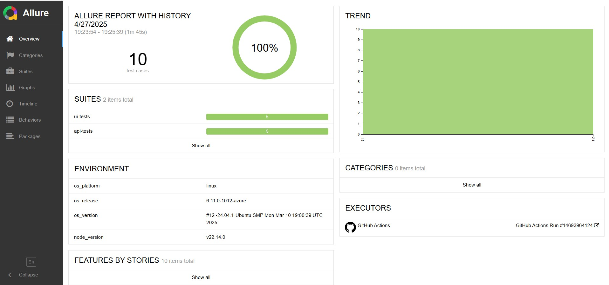
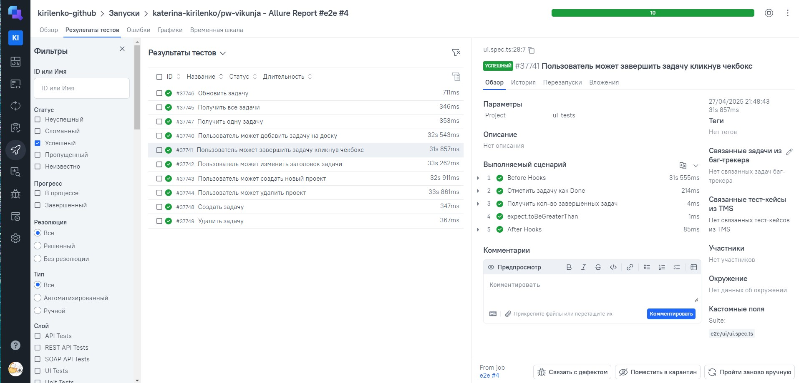
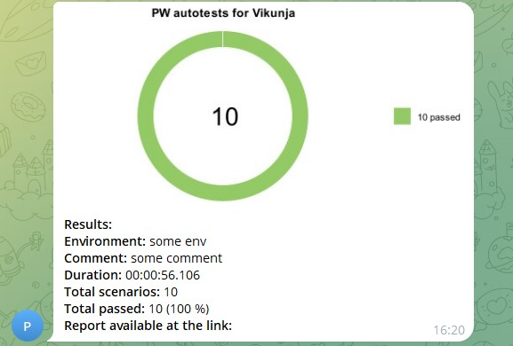

# Дипломный проект по автоматизации тестирования

Цель проекта - продемонстрировать навыки автоматизатора, полученные в рамках курса. Для тестирования выбран
сайт [Vikunja](https://vikunja.io/). Проект состоит из 4 блоков-навыков.

### UI автоматизация:

- 5 функциональных тестов с использованием Page Object, генератора данных.
- Ассерты обращаются к элементам страницы, или написаны свои ассерты, которые подключены к методам страницы

### API автоматизация:

- 5 функциональных тестов с использованием Service и генератора данных.

### CI-CD:

- Выполняется запуск автотестов или подключение docker образа автотестов в github CI/Jenkins
- Подключены уведомления в телеграмм

### Reporting:

- Подключен allure с сохранением истории в Github
- Добавлены скриншоты allure и allure testops
- Результаты запуска передаются в allure testops

---

## Технологический стек

<div align="center">
  
  
  
  
  
  
</div>

* TypeScript: Язык программирования, используемый для разработки тестов.
* Playwright: Фреймворк для автоматизации тестирования пользовательского интерфейса (UI) и взаимодействия с
  веб-приложениями.
* GitHub: Платформа для хостинга кода и управления версиями, а также для настройки CI/CD через GitHub Actions.
* Allure TestOps: Инструмент для управления тестированием и анализа результатов, интегрированный в процесс
  через Allure Report.
* Telegram: Мессенджер для отправки уведомлений о результатах выполнения тестов.

## Тест-кейсы

- UI
    - Добавить задачу на доску
    - Завершить задачу кликнув чекбокс
    - Изменить заголовок задачи
    - Создать новый проект
    - Удалить проект
- API
    - Получить все задачи
    - Получить одну задачу
    - Создать задачу
    - Обновить задачу
    - Удалить задачу

## Запуск тестов и генерация отчетов

Команда для локального запуска всех тестов

```
npx playwright test
```

Команда для локального формирования отчета

```
npx allure generate allure-results
npx allure open
```

## Пример сформированного [Allure-отчета](https://katerina-kirilenko.github.io/pw-vikunja/12/index.html#)



## Отчет в [TestOps](https://allure.autotests.cloud/launch/46154/tree?search=W3siaWQiOiJzdGF0dXMiLCJ0eXBlIjoidGVzdFN0YXR1c0FycmF5IiwidmFsdWUiOlsicGFzc2VkIl19XQ%3D%3D&treeId=0)



## Отправка сообщений в [Telegram](https://t.me/+-b6cNJ6dFkw2OTQy)

